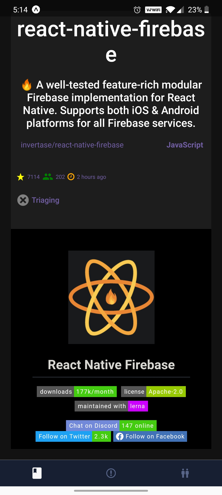
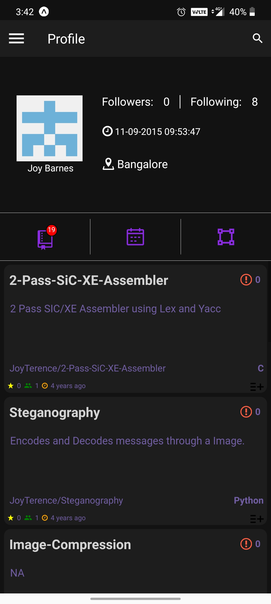
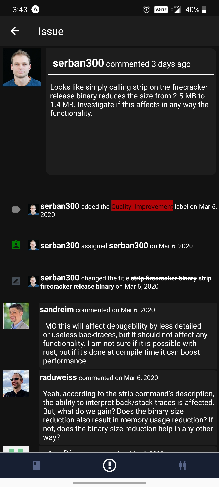
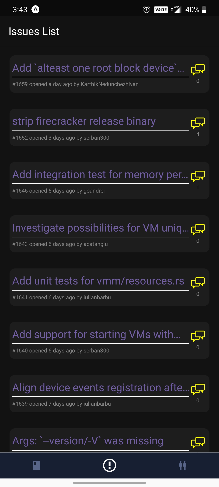
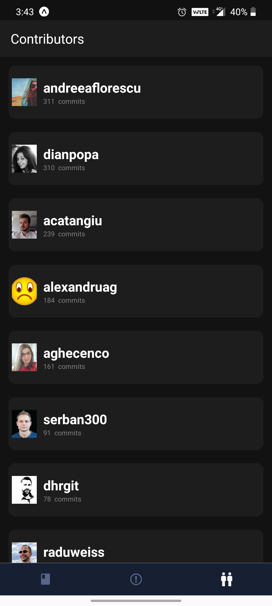
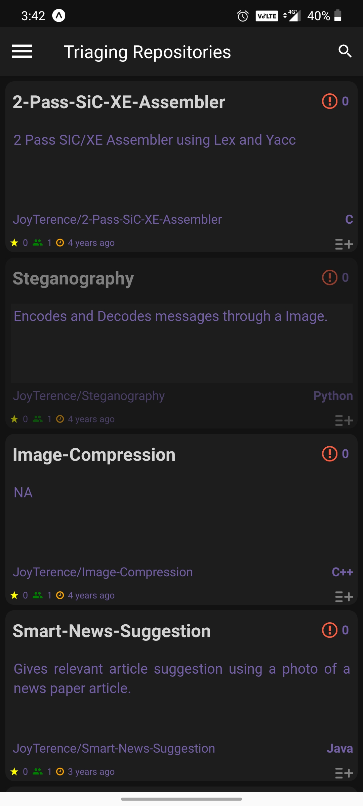
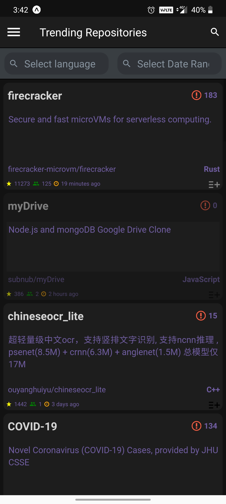
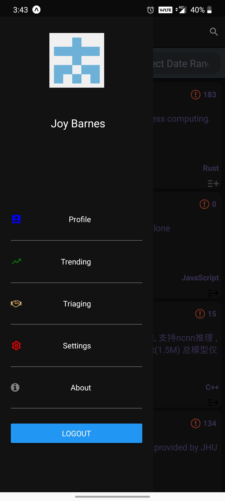

# GithubTriage
A React Native mobile app that mimics [Code Triage](https://www.codetriage.com)

This App was developed with mainly two intentions:
- To help the open source community by bringing the benifits offered by [Code Triage](https://www.codetriage.com)
- To familiarize myself with React Native, EXPO SDK, Google Cloud functions and Github OAuth with react native app.

## Important

I've tried to keep the names of various components as self descriptive as possible to keep the code readable by anyone.

Hope the following directory structure helps to get a brief understanding:

<pre>
+---assets  
|   \---icon.png  
|   \---splash.png  
+---resources  
|	+---images  
|		\---avatar.png                      - default image to be used if any Github user does not have an profile image  
+---screens  
|   +---IssueTimelineItems              - folder containing components used to display various timeline events in issue (comments, name change..)  
|	  |	  \---assignedEvent.js  
|	  |	  \---closedEvent.js  
|	  |	  \---crossReferencedEvent.js  
|	  |	  \---issueComment.js  
|	  |	  \---labeledEvent.js  
|	  |	  \---renamedTitleEvent.js  
|	  |	  \---reopenedEvent.js  
|	  |	  \---unAssignedEvent.js  
|	  |	  \---unLabeledEvent.js  
|   \---ContributionStatScreen.js       - Component responsible for displaying Stats about the user under profile screen  
|   \---ContributionListScreen.js       - Component responsible for list layout used to display the contributors of a particular repository under repository details  
|   \---ContributorsTileScreen.js       - Component responsible for displaying individual contributors in above list layout  
|   \---Issue.js                        - Component responsible for displaying issue main screen along with list layout of issues  
|   \---IssueTileScreen.js              - Component responsible for displaying individual issue in the list layout  
|   \---IssueTimelineScreen.js          - Component that checks the type of issue-timeline-event and uses he components from under `IssueTimelineItems` to display accordingly  
|   \---ReadMeTab.js					- Component responsible for displaying readme file of the repository  
|   \---RecyclerList.js					- Generic Component responsible for displaying list layout ( Chosen as it had additional benifits over regular list layout, developed by `Flipkart`)  
|   \---aboutMeScreen.js				- Component responsible for displaying about me screen of the app  
|   \---contributionScreen.js			- Component responsible for rendering the UI for `Contribution Heat Map` as can be seen in one's profile page in Github  
|   \---dashboardScreen.js				- Component responsible for displaying dashboard  
|   \---drawerScreen.js					- Component responsible for displaying side drawer screen  
|   \---issueListScreen.js				- Component responsible for list layout used to display the various OPEN issues of a repository  
|   \---loadingScreen.js				- Component responsible for displaying the Activity Indicator screen in case of any loading  
|   \---loginScreen.js					- Component responsible for displaying the initial login screen  
|   \---mainScreen.js					- Component responsible for displaying the initial screen that user lands on after logging into the app  
|   \---profileScreen.js				- Component responsible for displaying the basic logged-in user details  
|   \---repositoryListScreen.js			- Component responsible for list layout used to display various repositories after a search, or in trending section so on...  
|   \---repositoryScreen.js				- Component responsible for displaying main information about the repository  
|   \---repositoryTileScreen.js			- Component responsible for displaying individual repository in the repository list layout  
|   \---searchBarScreen.js				- Component responsible for displaying the search UI and perform the search related options  
|   \---settingsScreen.js				- Component that shows various App related configurations that can be done by a user  
|   \---trendingListScreen.js			- Component responsible for list layout of various trending repositories (can be searched on basis of language and frequency)  
|   \---triagingListScreen.js			- Component responsible for displaying the repositories that the user has opted to triage  
+---utils								- Folder containings various important and common functions used throughout the app  
|   \---HorizontalLine.js				- Renders a horizontal line  
|   \---LanguageList.js					- Holds a list of all the supported languages for querying  
|   \---LayoutUtil.js					- Controls how the `recyclerlistview` displays the list  
|   \---QueryUtils.js					- Contains various `GraphQL` based query strings, used throughout the app  
|   \---theme-context.js				- Controlls the display of elements in 'Dark Mode' or 'Light Mode'  
\---App.js								- Contains all the app navigation logic, implemented using `react-navigation`  
\---FirebaseProvider.js					- Contains logic to connect to firebase and query, modify the documents present in `Firestore`  
\---TrendingProvider.js					- Contains logic to fetch trending repositories using `Google Cloud Functions`  
\---app.json							- Contains basic information about the app  
</pre>

## Some ScreenShots of the App:

### Main Repository Screen

### Profile Screen

### Issue Screen

### List of Issues

### List of Contributors of the repository

### List of Repositories triaged by the user

### List of Repositories trending based on search filters

### Side Drawer Panel

